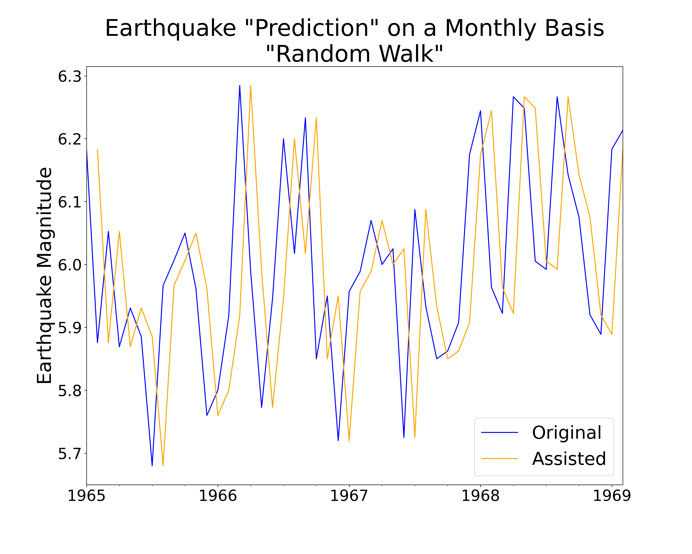

# On Shaky Ground - Earthquake Preparedness
---
**Author:** [Ted Brandon](https://github.com/theobigdog)

This repository has been created to present a data analytical approach to help the Earthquake Disaster Assistance Team predict magnitude of earthquakes on the Asian continent; Japan in particular.  This document is intended to bridge the gap between and technical and non-technical audiences.

## Repository Contents
---
Technical Jupyter Notebook (.ipynb) containing all data analysis
Matching pdf of the above notebook
The associated slideshow presentation, also in pdf-form

## Overview
---
Most everyone, even those who don't live in prone areas, knows about the awesome, yet devastating power of earthquakes, with caveats of landslides, liquifaction and tsunami. These aspects, combined, form a great threat to human lives, as well as infrastucture, dwellings, businesses, essential utilities such as power and water, etc.  March 11, 2011, a Magnitude(M)-9.0 earthquake off the east coast of Japan caused a tsunami that not only wreaked havoc, as described above, but also led to one of the worst nuclear catastrophies the world has seen. Estimated death count from this event is ~20,000 with roughly \$220 billion USD in damages in Japan alone.  December 26, 2004, a M-9.1 earthquake off the coast of Sumatra-Andaman caused a tsunami that hit all nearby islands and most nearby countries, including Indonesia, Sri Lanka, India, Maldives and Thailand. This earthquake resulted in the loss of at least 225,000 human lives, and damages of ~\$15 billion USD.  January 12, 2010, a M-7.0 earthquake in Haiti caused such excessive damage to person and property that, 10 years later, the country has still not recovered.  With an appropriate, predictive model, organizations, such as the Earthquake Disaster Assistance Team (EDAT) can better prepare for these monolithic events.

## Technical Understanding
---
The nature of the dataset chosen for this project warranted a Time-Series Model.  `Magnitude` was the Target, so this became an analysis of the magnitude of earthquakes over time.  To narrow down the scope, in an attempt to get better results, only Asia was examined, to start.  Fortunately for mankind, there were not, consistently, multiple earthquakes per day, which made it necessary to resample to a monthly mean.  A Dickey-Fuller test was performed on these data which provided a p-value < 0.05, but the “Test Statistic” was slightly greater than the [cutoff](https://en.wikipedia.org/wiki/Dickey%E2%80%93Fuller_test_for_stationarity), indicating a lack of stationarity.

A Random Walk was chosen as the First Simple Model (FSM), which provided a train RMSE of M-0.1823, as a baseline.  Next, ARIMA models were manually chosen and evaluated.  Both RMSE values and AIC (Akaike Information Criterion) were calculated for a few “likely” sets of parameters p, d and q.  The set with the most balanced results was (0,1,1).  Based on the Dickey Fuller results, d > 0 was expected, matching well with this set.  ACF and PACF tests were performed, which were difficult to clearly interpret, but appeared to result in q(ACF) and p(PACF) values of 0 or 1, each, again, matching with the manual test.  As seasonality is most always a factor in Time-Series, SARIMA was also investigated.  An automated “optimizer” was performed to check all combinations of p, d, q, P, D and Q with values 0-2.  Results of AIC analysis confirmed that (0,1,1) was the best option, and seasonality was not a factor (0,0,0,12).  During this process, it was determined that when fitting the models, a max_iter of 200 and application of the Nelder-Mead method were necessary.  Data were analyzed using these optimized parameters, resulting in a train/test RMSE of M-0.3074/0.1454, possibly indicating underfitting.  Further testing included SARIMAX to determine the effect(s) of exogenous variables.  This resulted in the conclusion that parameters of (0,1,1)x(0,0,0,12) with the addition of an exogenous variable, consisting of a single array of `Latitude` and `Longitude` values combined, produced the best results with a train/test RMSE of M-0.3111/0.1426.  This was chosen as the final model.  Japan was similarly examined, using quarterly resampled means, which resulted in a slightly different set of parameters, (1,0,1)x(0,0,0,4) and a train/test RMSE of M-0.1779/0.1885, which represented the best comparison observed for this process.

## Business Understanding
---
Formed in 2009, the [EDAT](https://www.usgs.gov/natural-hazards/earthquake-hazards/earthquake-disaster-assistance-team-edat) is an international rapid response team under the United States Geological Survey (USGS) umbrella.  The purpose of this study was to provide the EDAT with a valuable, predictive model of future earthquake magnitudes, preferably including information on location (latitude and longitude) as well.  Being an internationally active organization, particular attention need be paid to the Asian continent which, while only comprising 30% of the planet's land surface-area, ~39% of all earthquakes occur here.  While being a relatively small country, Japan, specifically, receives the brunt of ~25% of all earthquakes in Asia and ~9% of all earthquakes, globally.  As an island-nation, Japan is particularly prone not only to earthquakes, but tsunami as well.  With a predictive model of magnitude, relative to location, earthquake preparation can become more robust and impactful, spreading to all countries and continents on the globe.


## Data Understanding
---


All data come from the Kaggle "Significant Earthquakes, 1965-2016" dataset, which includes the date, time and location of all earthquakes with a magnitude of 5.5 or higher during this time frame. The set contains ~23,000 entries with 21 features(columns), including, in addition to the above, such information as type, depth, seismic stations and magnitude types, amongst others. The target column, Magnitude includes the relative strength of each earthquake-entry. The other features of interest in this dataset include Latitude, Longitude and Depth, with many remaining columns lacking enough information to allow for proper model-development. I was able to use the features provided about each earthquake to develop a predictive model for future earthquake magnitudes, relative to geographical location, allowing for a better sense of preparedness to be developed.

## Column Inclusion/EDA
---
Multiple columns in this dataset were missing literally 1,000s of entries, making them unusable for this analysis.  These included, `Depth Error`, `Depth Seismic Stations`, `Magnitude Error`, `Magnitude Seismic Stations`, `Azimuthal Gap`, `Horizontal Distance`, `Horizontal Error` and `Root Mean Square`.  Additionally, the vast majority of entries in the `Type` column were indicated as "earthquake", while a very small portion included things such as nuclear detonations.  All entries not of `Type` earthquake were dropped, resulting in the ability to drop the `Type` column, entirely.  Part of this process included combining the `Date` and `Time` columns to create a new `Date_Time` feature, which was then converted to datatype DateTime.  During this process, three records were discovered to have inconsistent date entries, resulting in the need to drop these three records altogether.  All-in-all, a total loss of only 0.78% of starting data was necessary.  No further EDA was required.

## Country Names
---
Records did not include nations in which the earthquakes occurred, rather, very accurate latitude and longitude were provided.  Python does not have any built-in libraries to convert coordinates to country, which was necessary for this project to focus on earthquakes in Asia; Japan in particular.  Therefore, it was necessary to install "reverse_geocoder" (to acquire a "cc" or country code for each record) as well as "country_converter" (to convert each cc to the appropriate country name) to perform this process.  This step took about 4hr to compile, resulting in the need to export the generated .csv file, which could then be imported back into the notebook for future use.  The original code was "commented-out" to prevent unnecessarily repeating this process.

## Modeling & Evaluation
---

Due to the nature of this dataset, and earthquakes in general, time-series was the most logical approach to modeling.  The amount and spread of data of Asian earthquakes during this time period necessitated a monthly-mean resampling.  First model consisted of a "Random Walk"(above), with a train Root Mean Squared Error (RMSE) of M-0.1823.  A Dickey-Fuller test indicated a lack of stationarity in the series, leading to the (inevitable) need to prepare an Autogressive, Integrated Moving Average (ARIMA) model.  Both the Auto-Correlation Function (ACF) and the Partial Auto-Correlation Function (PACF) were used to evaluate the data, and eventually helped determine the best ARIMA model (based partially on Akaike Information Criteria, or AIC value), producing a train RMSE of M-0.1396.  Earthquakes have not been shown to be seasonal, but to be thorough, SARIMA models were generated with an "automated optimizer", the evaluation of which confirmed a lack of seasonality, as well as confirming the p, d and q ARIMA parameters of (0,1,1).  Finally, to determine the effect of exogenous variables (e.g. latitude, longitude and depth) on earthquake magnitude, SARIMAX models were developed and tested, with a final result of a (0,1,1) x (0,0,0,12) SARIMAX with an exogenous variable (comprised of a latitude/longitude array, allowing the combo to be treated as a single variable), resulting in a train/test RMSE of M-0.3111/0.1426.  Additionally, Japanese earthquakes were similarly evaluated, requiring quarterly mean resampling, due to even more limited sample-size.  Final model for this refined dataset was also a SARIMAX of (1,0,1) x (0,0,0,4), with the same exogenous location-based array-variable.  Train/test RMSE results were M-0.1779/0.1885.

## Conclusions
---
While it is not currently feasible to predict both specific location as well as magnitude, not-to-mention specific timing of earthquakes, this model has shown to be a good predictor of magnitude of earthquakes in Asia and Japan in particular.  Asia and Japan were predicted to have M-5.88 ± 0.143 and M-5.90 ± 0.189, respectively, earthquakes, both of which were significantly, geographically related.  I offer these results to the Earthquake Disaster Assistance Team, with the intention to help in the process of earthquake preparedness.


Project Structure
```bash
├──.ipynb_checkpoints
├──Slideshow presentation
├──data
├──images
```
