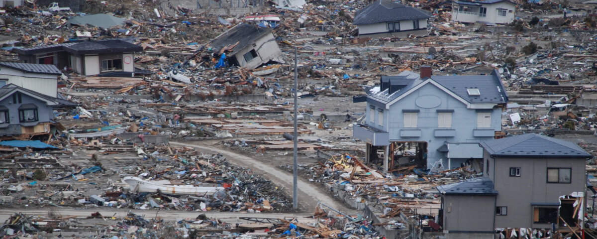

# On Shaky Ground
---
**Author:** [Ted Brandon](https://github.com/theobigdog)

## Introduction
---
Most everyone, even those who don't live in prone areas, knows about earthquakes and the devastating damage they can cause, with caveats of landslides, liquifaction and tsunami. All of these aspects, combined, form a great threat to human lives, as well as infrastucture, dwellings, businesses, all other structures, etc.,... On March 11, 2011, a M-9.0 earthquake off the east coast of Japan caused a tsunami that not only wreaked havoc, as described above, but also led to one of the worst nuclear catastrophies the world has seen. Estimated death count for this event is ~20,000 with an estimation of $220 billion USD in damages in Japan alone. On December 26, 2004, a M-9.1 earthquake off the coast of Sumatra-Andaman caused a tsunami that hit all nearby islands and most nearby countries, including Indonesia, Sri Lanka, India, Maldives and Thailand. This earthquake resulted in  at least 225,000 casualties, and damages of ~$15 billion USD. On January 12, 2010, a M-7.0 earthquake in Haiti caused such excessive damage to person and property that the country has still not recovered.

## Business Understanding
---
Formed in 2009, The Earthquake Disaster Assistance Team (EDAT) is an international rapid response team under the United States Geological Survery (USGS) umbrella.

## Data Understanding
---
Data

